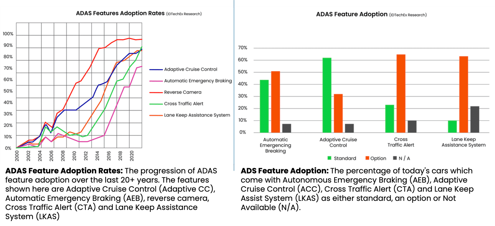

<!--
author:   David Croft, Karim El Haloui, Morteza Solimani, Sulakshan Rajendran, Umang Parekh, Valentina Donzella

email:    david.croft@warwick.ac.uk

version:  0.0.1

language: en

narrator: UK English Female

comment:  

classroom: false
icon: https://dscroft.github.io/liascript_materials/assets/logo.svg

@style
.flex-container {
    display: flex;
    flex-wrap: wrap; /* Allows the items to wrap as needed */
    align-items: stretch;
    gap: 20px; /* Adds both horizontal and vertical spacing between items */
}

.flex-child { 
    flex: 1;
    margin-right: 20px; /* Adds space between the columns */
}

@media (max-width: 600px) {
    .flex-child {
        flex: 100%; /* Makes the child divs take up the full width on slim devices */
        margin-right: 0; /* Removes the right margin */
    }
}
@end

@big_quote
<!-- style="font-size: 3em; text-align: center;" -->
@end

@sectiontoc

@end

@session_attribution

  <!-- style="border-radius: 50%;" -->

  This session is developed by:

  @1 (@2)

  <!-- style="font-size: 2em" -->
  🕙 Anticipated duration: @3.

@end
-->           

# Introduction to Online SCAV

Anticipated duration: **1 hour 45 minutes.**

JOIN this session on:

Date: **Day 1**

Time: **09:00 to 09:30 AM (UK Time Zone)**

by clicking on the link below

[Microsoft Teams Link](https://skillscentre.wmg.warwick.ac.uk/moodle/mod/page/view.php?id=1866)

**Please join this session at the designated date and time to avoid missing valuable information.**

> ℹ️ You can navigate through the material using:
> 
> - The arrow buttons at the bottom of the page.
> - The arrow keys on your keyboard.
> - The navigation bar on the left.

# The Automotive Industry 

@session_attribution(scormcontent/assets/6nggj2/Karim_small.png, 
  Karim El Haloui,
  Assistant Professor,
  15 minutes)

------------

Learning Outcomes
================

At the end of this session you should be able to:

- Appreciate the changing landscape the automotive industry is experiencing.

## Automotive Market

The Automotive Market: A 2.5 to 3 Trillion Dollar Industry
=======================

[Statista.com](https://www.statista.com/)

--{{0}}--
The global automotive manufacturing market was valued at approximately 2.86 trillion U.S. dollars in 2021, with projections indicating a modest increase to 2.95 trillion U.S. dollars in 2022. This represents a gradual recovery, still below the industry's 2019 peak.
The automotive sector is poised for significant technological advancements over the next decade. By 2030, electric vehicles are expected to account for 26% of global new car sales, with an estimated 58 million self-driving cars joining the global fleet.
Technological progress is reshaping the demand for automotive components, driving further specialization in the supplier sector, particularly in automotive electronics. Automation and electrification are the primary disruptors, with electronic components, especially semiconductors, becoming increasingly critical for vehicle production.

The global automotive manufacturing market was worth about 2.86 trillion U.S. dollars in 2021. The market is projected to grow to some 2.95 trillion U.S. dollars in 2022. This growth is a slow recovery, still under the industry's 2019 market size.  

**Automation and Electrification Drive Market Disruption**

Automotive technology will change considerably in the next decade. Some 26 percent of new car sales globally are expected to be electric vehicles in 2030, and about 58 million new self-driving cars are projected to be added to the world's fleet that year.  

**New Opportunities in the Supplier Segment**

Technological advancements begin to affect the type of parts required to complete the finished product. This allows for further segmentation in the auto supplier industry, particularly within the automotive electronics industry. The biggest changes to the automotive industry currently are automation and electrification. As automated and electric vehicles take over the market, electronic components, especially automotive semiconductors, will become even more important for automotive manufacturing.

<!--
data-title="Sales in units"
data-xlabel="Year"
data-ylabel="USD Trillions"
data-show="true"
data-type="barchart"
-->
| Year | |
|------|-----|
| 2019 | 2.88 |
| 2020 | 2.62 |
| 2021 | 2.65 |
| 2022 | 2.52 |
| 2023 | 2.56 |

<!-- style="display:none" -->
<iframe src="scormcontent/assets/Ayqp4eKU9zytFaXW/story.html" width="100%" height="56.25%" frameborder="1"></iframe>

## Sales in Units

95 million units in 2016 (passenger cars, light commercial vehicles, minibuses, trucks, buses, and coaches)

**The product spectrum is divided into:**

- Passenger cars
- Commercial vehicles

-------------------------

**The Current State of the Market**

--{{0}}--
In 2022, global motor vehicle sales exceeded 81.6 million units. China led the market with nearly 23 million new car registrations, followed by the United States and Europe, with the U.S. recording approximately 14 million light vehicle sales. 
Volkswagen Group and Toyota Motor were the top automakers in 2021, generating revenues of $296 billion and $282 billion, respectively. However, both faced challenges from the COVID-19 pandemic, with Toyota's revenue declining by 9%. Additionally, the global semiconductor shortage in 2021-2022 caused inventory shortages and extended vehicle delivery times.

In 2022, motor vehicle sales reached just over 81.6 million units worldwide. 

China was the largest automobile market worldwide, making up nearly 23 million new car registrations that year. 
The United States and Europe ranked second and third, with light vehicle sales reaching approximately 14 million units in the U.S. market. 

The German-based Volkswagen Group and Japanese Toyota Motor were the global leading automakers, with revenues reaching around 296 and 282 billion U.S. dollars, respectively, in 2021. 

These companies were impacted by the economic downturn linked with the COVID-19 pandemic, with Toyota's revenue falling by nine per cent. 

The global automotive semiconductor shortage in 2021 and 2022 further impacted manufacturers, leading to a drop in inventory and longer waiting times to purchase a new vehicle.

<!--
data-title="Sales in units"
data-xlabel="Year"
data-ylabel="Units Millions"
data-show="true"
data-type="barchart"
-->
| Year | Passenger cars | Commercial vehicles |
|------|-----|-----|
| 2016 | 69.46 | 24.39 |
| 2017 | 70.69 | 24.97 |
| 2018 | 68.69 | 26.37 |
| 2019 | 64.03 | 27.21 |
| 2020 | 53.92 | 24.87 |
| 2021 | 56.44 | 26.32 |
| 2022 | 57.49 | 24.14 |

<!-- style="display:none" -->
<iframe src="scormcontent/assets/X7IB6Ecscv4Djog7/story.html" width="100%" height="56.25%" frameborder="1"></iframe>

## Number of Passenger Cars Produced Per Country

!?[Video](scormcontent/assets/Statista-Racing-Bars-China's-Rise-to-Global-Car-Production-Dominance.mp4 "Video taken from: <https://www.youtube.com/watch?v=4r8Dgv650aU&t=1s>")

## Automobile Production from 2000 to 2022

<!--
data-title="Sales in units"
data-xlabel="Year"
data-ylabel="Automobile Production-million"
data-show="true"
-->
| Year | |
|------|-----|
| 2000 | 58 |
| 2001 | 56 |
| 2002 | 59 |
| 2003 | 61 |
| 2004 | 65 |
| 2005 | 67 |
| 2006 | 69 |
| 2007 | 73 |
| 2008 | 71 |
| 2009 | 63 |
| 2010 | 77 |
| 2011 | 80 |
| 2012 | 84 |
| 2013 | 87 |
| 2014 | 90 |
| 2015 | 91 |
| 2016 | 95 |
| 2017 | 97 |
| 2018 | 97 |
| 2019 | 93 |
| 2020 | 77 |
| 2021 | 80 |
| 2022 | 85 |

--{{0}}--
In 2022, global motor vehicle production reached approximately 85 million units, marking a 6% increase from the previous year. China led as the largest passenger car manufacturer, producing over 21 million vehicles in 2021, which accounted for nearly one-third of global passenger car production. Over the years, China has solidified its position as a key growth market in the global automotive industry.

In 2022, some 85 million motor vehicles were produced worldwide. This figure translates into an increase of around six percent compared with the previous year. China, Japan, and Germany were the largest producers of cars and commercial vehicles in 2022.

**China Leads Production**

China is ranked as the largest passenger car manufacturer in the world, having produced more than 21 million cars in 2021, accounting for almost one-third of the world's passenger vehicle production. Over the past decades, China has emerged as one of the main growth markets for players in the global automobile industry.

## Passenger Car Production in 2021

--{{0}}--
China accounts for over 30% of global vehicle production and sales. The automotive market is increasingly shifting towards Asia, with China solidifying its position as a dominant leader in both production and sales. The country is expected to continue its growth trajectory, with a significant share of the global automotive market projected to be in Asia, particularly in China. This shift is indicative of the changing dynamics in the automotive industry, where traditional markets are being challenged by emerging economies.

China alone is responsible for more than 30% of all vehicles produced and sold globally.

<iframe src="scormcontent/assets/H0LTDQm1CrB2Iidw/story.html" width="100%" height="62.5%" frameborder="1"></iframe>

The most noticeable trend is the shift toward Asia, where China is increasing its lead as the most important automotive market in both **production** and **sales.**

# Automotive Megatrends

@session_attribution(scormcontent/assets/6nggj2/Karim_small.png, 
  Karim El Haloui, 
  Assistant Professor, 
  1 hour 15 minutes)

Six Megatrends that can be observed in the Automotive Industry
==============================================================

Click on the links below to navigate to specific sections:

@sectiontoc

## Tighter Emission Controls and the Rise of Electric Vehicles

!?[Video](scormcontent/assets/Pollution-Video-1080p-240109.mp4 "Tighter emissions")

- Rising concern about health problems in Europe, the USA, and emerging countries due to carbon emissions from a rapidly growing fleet of cars.

- The problem is clearly seen considering:

  - Enormous growth in car ownership
  - Car density

- Zero emission target.

### Have you Heard of the Diesel Gate Scandal?

Let's watch a detailed video explaining the Diesel Gate Scandal and understand why Volkswagen was accused of using a "defeat device" to side-step emission laws.

!?[Video](scormcontent/assets/Volkswagen's-diesel-scandal,-explained.mp4 "Video taken from: <https://www.youtube.com/watch?v=CQ4irwe3ZDk>")

### The Rise of Electric Vehicles

?[Audio](scormcontent/assets/Rise-of-Electric-Vehicles-1-2.mp3 "The Rise of Electric Vehicles-1")

Find the transcript corresponding to the above audio content here.

[Attachment](scormcontent/assets/Transcript--The-Rise-of-Electric-Vehicles-1.pdf)

Source: <https://www.eea.europa.eu/en/analysis/indicators/new-registrations-of-electric-vehicles>

<iframe src="scormcontent/assets/vrl08QXoHiadttfR/story.html" width="100%" height="39.826212889210716%" frameborder="1"></iframe>

?[Audio](scormcontent/assets/Rise-of-electric-vehicles-2-2.mp3 "The Rise of Electric Vehicles-2")

Find the transcript corresponding to the above audio content here.

[Attachment](scormcontent/assets/Transcript--The-Rise-of-Electric-Vehicles-2.pdf)

### Tighter Emission Controls

<section class="flex-container">

<!-- class="flex-child" style="min-width: 250px" -->

**The number of electric vehicles sold in Europe so far is still small due to:**

1. Cost of the vehicle, with the battery as the primary cost driver
2. Inadequate charging infrastructure
3. Limited range
4. Time needed for charging

</section>

--------------------------

<section class="flex-container">

**Need a push from public institutes & standardisation bodies:**

1. No infrastructure → no incentive to buy electric cars → no incentive to build infrastructure (Give incentives by public institutions)
2. High battery price → only a few electric cars can be sold → affects the attractiveness of electric cars
3. Competing charging standard

<!-- class="flex-child" style="min-width: 250px" -->

</section>
  
!?[Video](scormcontent/assets/Day-1_Inadequate-infrastructure-1080p-231220.mp4 "Inadequate Infrastructure")

### Electrification and ADS

!?[Video](scormcontent/assets/Day-1-Electrification-and-ADS-1080p-231215.mp4 "Electrification and ADS")

## Car Ownership Vs Mobility

A trend has emerged in Europe, especially among the younger population.
==========

- Car ownership has become less important.
- Many younger people don't even have a driver's licence anymore.
- MaaS (Mobility as a Service).

The focus is on mobility and flexibility in choosing between various modes of transportation.
============

A car is regarded as a costly asset due to:

- Purchase Price
- Depreciation Costs
- Fuel Costs
- Insurance
- Maintenance and Repair Costs

-----------------------------

?[Audio](scormcontent/assets/Car-Ownership-Versus-Mobility--1-.mp3 "Car Ownership Vs Mobility")

Find the transcript corresponding to the above audio content here.

[Attachment](scormcontent/assets/Transcript--Car-Ownership-Vs-Mobility.pdf)

-----------------------------

### Ride Hailing and ADS

!?[Video](scormcontent/assets/Ride-hailing-and-ADS.mp4 "Ride hailing and ADS")

### Car Ownership Versus Mobility: An Example

!?[Video](scormcontent/assets/Car-ownership-video_edited.mp4 "Video source: <https://www.a-to-be.com/urban-mobility/maas-platform/>")

-------------------------

## Connectivity

Connectivity refers to the connection between cars and other systems.

- Car-2-Car (C2C) or Vehicle-2-Vehicle (V2V),
- Vehicle-2-Infrastructure (V2I),
- Vehicle-2-Backend (V2B),…

As shown in the figure below, this concept and the related business models could disrupt the automotive industry.

!?[Video](scormcontent/assets/Connectivity-1080p-240109.mp4 "Application areas of the connected car")

-----------------------------

?[Audio](scormcontent/assets/Connectivity-and-cybersecurity.mp3 "Connectivity")

Find the transcript corresponding to the above audio content here.

[Attachment](scormcontent/assets/Transcript--Connectivity.pdf)

-----------------------------

### Cybersecurity Issues

- With connectivity comes the threat of cyberattacks.
- Multiple cyberattacks have been reported over the last few years, and automotive OEMs take this threat very seriously.
- Intrusion detection and prevention systems that constantly monitor data.

Activity
========

**What do you know about cyberattacks? List them below.**

**Duration: 10 minutes**

> To add a comment to the Padlet below click on the '+' symbol you can see in the bottom right-hand corner of the frame below. Once the panel opens you will see a pink hexagon, clicking on this will provide you with additional options such as uploading an image, sharing a file, adding a link or opening a digital whiteboard tool.**

<iframe src="https://warwick.padlet.org/embed/uxbzay6gogafr2qr" frameborder="0" width="100%" height="50%" allow="camera;microphone;geolocation"></iframe>

----------------------

Watch the video below to see how hackers remotely kill a Jeep on a Highway.

!?[Video](scormcontent/assets/Hackers-Remotely-Kill-a-Jeep-on-a-Highway-_-WIRED.mp4 "Hackers remotely kill a Jeep on a Highway")

### ISO 21434: Road Vehicles - Cybersecurity Engineering

A new standard has emerged, ISO/SAE 21434:2021. It will enable organisations to:

- define cybersecurity policies and processes;
- manage cybersecurity risk;
- foster a cybersecurity culture.

It links strongly with functional safety standards for automotive E/E systems in ISO 26262. 
By addressing vulnerabilities and potential threats, 
ISO 21434 contributes to securing critical vehicle functions, 
reducing the risk of unauthorised access, 
and bolstering overall vehicle safety, 
providing consumers and regulatory bodies with confidence in the cybersecurity measures implemented in modern vehicles.

### ISO 21434: Overall Cybersecurity Risk Management

-----------------------

?[Audio](scormcontent/assets/ISOSAE-21434-Overall-cybersecurity-risk-management.mp3 "ISO 21434: Overall Cybersecurity Risk Management")

Find the transcript corresponding to the above audio content here. 

[Attachment](scormcontent/assets/Transcript--ISO-21434--Overall-Cybersecurity-Risk-Management.pdf)

-------------------------

## Safety and Advanced Driver Assistance Systems

@big_quote
It is important to note that 1950-1970 saw a tremendous increase in road traffic. 
Without regulatory measures and proper enforcement, fatal accidents would have exploded.

### Effect of Regulatory Measures on Road Mortality

The trend in the number of persons killed in road traffic accidents.

<iframe src="scormcontent/assets/Wbb-8POXnJ8dLYUs/story.html" width="100%" height="55.756698044895%" frameborder="1"></iframe>

### Safety

1. Automotive manufacturers continue to work on increasing safety in various ways
   1. Advanced Driving Assistance Systems (ADAS).
   2. Passive safety measures (crashworthiness improvements to the car body).
   3. Protection for pedestrians (e.g., soft bumpers).
2. The foundation for the rapid development of the ADAS market was laid by
   1. The development of sensor technology.
   2. The development of signal-processing algorithms.

With the increased safety standards and consumer demand for safety performance, the ADAS market has become one of the fastest-growing segments in automotive E/E systems.

### ADAS Adoption Rate and Features

-------------------------

?[Audio](scormcontent/assets/ADAS-adoption-rate-and-feature-adoption.mp3 "ADAS Adoption Rate and Features")

Find the transcript corresponding to the above audio content here.

[Attachment](scormcontent/assets/Transcript-ADAS-Adoption-Rate-and-Features.pdf)

## Automated Driving

This is not a new topic
=============

- Daimler, for example, was active in a research project in the 1990s to explore the possibility of a fully automated car.

Can you consider why OEMs took so long to regain a strong interest in automated driving?
================

- In the 1990s, however, the computing platforms were less powerful and building a self-driving vehicle on an affordable budget was outside the scope.
- Today, cheap access to computing power in the range of gigaflops or even teraflops has sparked new interest in the development of new technologies.
- With an ever-increasing demand for low-cost mobility in passenger and freight transportation, automated vehicles are now at the centre of many OEM and Tier 1 suppliers' Research and Development (R&D) initiatives.

Activity
========

**Drag and drop the grey boxes into the correct spaces.**

**Duration: 8 minutes**

You've often read or heard about automated cars. 
A precise definition is given in the SAE J3016 standard. 
Six levels of autonomy are defined there. 
Can you guess the driver's role and what the automated system is meant to do? 
Once completed, we will further explore this standard and understand its preponderant role in the industry and involved stakeholders.

<iframe src="scormcontent/assets/FwuoThjxzjqkKyah/story.html" width="100%" height="95.45454545454545%" frameborder="1"></iframe>

### Problems to Overcome for Full Automated Driving

Although advanced driver assistance systems already take over a lot of responsibilities, full autonomy is still some time away.

What could be the problems?

Activity
========

**Duration: 10 minutes**

**Question:**Please list the problems to overcome for fully automated driving.

> To add a comment to the Padlet below click on the '+' symbol you can see in the bottom right-hand corner of the frame below. 
> Once the panel opens you will see a pink hexagon, clicking on this will provide you with additional options such as uploading an image, sharing a file, adding a link or opening a digital whiteboard tool. 

<iframe src="https://warwick.padlet.org/embed/cmzzto0rntahugup" frameborder="0" width="100%" height="50%" allow="camera;microphone;geolocation"></iframe>

-------------------------

@big_quote
The timeline for automated driving is the focus of a lively debate both in public and in scientific and industrial task forces.

@big_quote
The impact will not only be **technical** but also **social** and **ethical** as the transport industry offers many jobs that are being challenged.

## Digitalisation

- Digitalisation and the digital transformation of value chains have become central economic topics.
- The automotive industry is heavily involved in Information Technology (IT)-based innovations and the digital transformation of processes.
- The activities of automotive engineering are sometimes referred to as virtual product creation.

  * Computational models dominate the product development process.
  * No factory is built until everything, from manufacturing processes, tooling, logistics, and even ergonomics, has been simulated thoroughly.

### Future Potential Development

- There is still a lot to do on the customer-direct interaction front

  * The aftersales market has huge potential for digital transformation
    
    - Remote diagnostics
    - Recovery of stolen vehicles
- Maintenance costs can be estimated, the workflow for a repair determined, and spare parts can be ordered in real-time…
  
  * Sensors drifting, recalibration after an accident
  * Insurance model

# New Players & Challenges

- A 3-trillion Pound market, like the global automotive industry, attracts new players; the electric vehicle market is especially dynamic.

- Each year, new start-ups, many from China or funded by Chinese investors, are coming up

  * Byton, Faraday
  * Future, Karma, BYD...

- New industries are attracted by the many hours drivers and passengers spend in a car every day.

  * This is the perfect time to provide content, entertainment, and information.
  * especially if driver assistance functions and automated driving are freed up in the future.

### Google and Waymo

- Google, for example, has been experimenting with automated driving for years.

- The goal is not to build Google car factories but to use the company's vast digital infrastructure.

  * search capabilities, maps, the Android mobile.
  * operating system, speech-based assistance functions…

- Google partnered with Fiat Chrysler Automobiles to develop an automated mini-van.

  * built a fleet of 100 self-driving mini-vans.
  * This is the first time a Silicon Valley firm has teamed up with a traditional automaker to develop an automated vehicle.

### Challenges of Automated Driving

!?[Video](scormcontent/assets/Challenges-of-automated-driving.mp4 "Challenges of Automated Driving")

### Big Tech and Cars

**Many more big tech companies are exploring automated driving opportunities.**

- Apple & the Titan project. They also bought drive.ai
- Amazon acquired self-driving car startup Zoox ($1 billion).
- Other big players, in particular from China, are investing into the automotive industry: AutoX (robotaxi).
- Tech giant Baidu in April formally launched a robotaxi service in Changsha, as part of its Apollo programme.

# The Automotive Industry Roadmaps & (CAV Standards)

@session_attribution(scormcontent/assets/6nggj2/Karim_small.png, 
  Karim El Haloui, 
  Assistant Professor, 
  1 hour 45 minutes)

Learning Outcomes
================

**At the end of this session, you should be able to:**

1. Understand the need and relevance of standards for the development of the automotive industry and your company.
2.Appreciate the benefits provided by roadmaps for Connected Automated Vehicles (CAV).
3. Identify the key CAV activities led in the U.K.

## Definitions

Activity
=======

**How would you define these different terms?**

Duration: 10 minutes 

> To add a comment to the Padlet below click on the '+' symbol you can see in the bottom right-hand corner of the frame below. Once the panel opens you will see a pink hexagon, clicking on this will provide you with additional options such as uploading an image, sharing a file, adding a link or opening a digital whiteboard tool. 

<iframe src="https://warwick.padlet.org/embed/csqh9esdbr1rqeoo" frameborder="0" width="100%" height="50%" allow="camera;microphone;geolocation"></iframe>

-------------------------

Activity
========

**In the news, academic papers, and projects, these terms are often used interchangeably: Automated Vehicles, Autonomous Vehicles, Self-driving cars, driverless cars etc.**

Duration: 10 minutes

> To add a comment to the Padlet below click on the '+' symbol you can see in the bottom right-hand corner of the frame below. Once the panel opens you will see a pink hexagon, clicking on this will provide you with additional options such as uploading an image, sharing a file, adding a link or opening a digital whiteboard tool. 

<iframe src="https://warwick.padlet.org/embed/87aafd9y3ukncz2q" frameborder="0" width="100%" height="50%" allow="camera;microphone;geolocation"></iframe>

### Industry Need

- The Automotive Industry needs a consistent, reliable set of terms and definitions in the Connected and Automated Vehicles (CAV) sector.

  * Insurers, regulators, legislators and organisations involved in CAV infrastructure.
  * As well as CAV manufacturers and consumers.

- Which sources? Scope of each source? Where to start?

  * IEEE (Institute of Electrical and Electronics Engineers),
  * BSI (British Standards Institution),
  * SAE (Society of Automotive Engineers),
  * ERTRAC (European Road Transport Research Advisory Council).

### Roadmaps for CAV

Please review each provided link by skimming through its contents. 
Consider saving these links for future reference, as they contain valuable information that contributes to understanding the current landscape of automated driving activities and the direction in which they are heading.

- Need to understand the development of standards for CAV.
- Various Roadmaps for CAV.

  * ERTRAC for the European Union: [Connected, Cooperative and Automated Mobility Roadmap](https://www.ertrac.org/wp-content/uploads/2022/07/ERTRAC-CCAM-Roadmap-V10.pdf), 02/2022, v10.
  * Zenzic: [UK Connected and Automated Mobility Roadmap to 2035](https://zenzic.io/wp-content/uploads/2023/03/Roadmap-to-2035-%E2%80%93Executive-Summary_v6.pdf), 03/2023, v6.
  * BSI for the UK: [Connected and Automated Vehicles Standards Roadmap](https://www.bsigroup.com/globalassets/localfiles/en-gb/cav/bsi-cav-standards-roadmap-august-2020-v1.pdf), 08/2020, v1.
  
    * [2022 update](https://www.bsigroup.com/globalassets/localfiles/en-gb/cav/cav-standards-roadmap/cav-standards-roadmap-2022.pdf)

### What/Who is Zenzic?

- Zenzic is a body created by the UK government and CAV industries to:

  * Focus on key areas of UK capability in the global connected and automated driving sector.
  * Accelerate the automated driving revolution in the UK.

- Zenzic is channelling £200 million of investment to unite industry, government and academia in the move to a safer, more inclusive and productive mobile future.
- Zenzic is built upon three core pillars: Insights, Innovation and Collaboration.

### Zenzic Ecosystem

Zenzic is championing the UK's Connected and Automated Mobility (CAM) ecosystem to ensure a safer, more secure, sustainable, and inclusive transport future. Zenzic exists to make champions of others and place the UK at the heart of the global CAM ecosystem. By leveraging the power of innovation through collaboration, Zenzic promotes and enables UK organisations to play an impactful role in the future of mobility, as seen in the figure below.

### Zenzic Roadmap: Quick Overview

- The Roadmap is designed to provide insights into Connected and Automated Mobility (CAM) for many different organisations.
- It establishes a clear picture of the progress and who contributes to the UK CAM ecosystem.
- It is structured around four themes: Society and People, Vehicles, Infrastructure and Services. 

### Interactive Tool

Explore the [interactive tool](https://uk.sharpcloud.com/html/#/story/7bbbf0a9-ec52-4515-8540-4841e5acb7e4/view/81637fc5-0cc1-44af-b064-07ca0cfc4cc9) that has been developed to help CAV stakeholders in your own free time. 
Watch the video below to explore more.

!?[Video](scormcontent/assets/Interactive-Roadmap-Tutorial.mp4 "Video source: <https://www.youtube.com/watch?v=i1hAlX51O90>")

## British Standards Institution (BSI)

The British Standards Institution (BSI) is the national standards body of the United Kingdom. BSI produces technical standards on a wide range of products and services and also supplies certification and standards-related services to businesses.

@big_quote
"At BSI, our mission is to share knowledge, innovation and best practices to help people and organisations make excellence a habit."

@big_quote
"This is underpinned by our role as the national standards body and through our prestigious Royal Charter."

### Activities

Activity
========

**Skim through the 1st link and reflect on the priority gaps listed on the 2nd link from a standardisation point of view. No submission is needed for this activity. **

Duration: 10 minutes

1. [Connected and Automated Vehicles Standards Roadmap](https://www.bsigroup.com/globalassets/localfiles/en-gb/cav/bsi-cav-standards-roadmap-august-2020-v1.pdf)
2. [BSI CAV Standards Roadmap 2022](https://www.bsigroup.com/globalassets/localfiles/en-gb/cav/cav-standards-roadmap/cav-standards-roadmap-2022.pdf)

--------------------

Activity
========

**Written Assignment**

**Duration: 60 minutes**

Select a published BSI standard of interest to you from the list below and:

1. [BS ISO 23150:2023 Road vehicles](scormcontent/assets/BS-ISO-23150-2023.pdf) - Data communication between sensors and data fusion unit for automated driving functions - Logical interface
2. [BS ISO 21448:2022 Road vehicles](scormcontent/assets/BS-ISO-21448-2022.pdf) - Safety of the intended functionality
3.  [PAS 1885:2018 The fundamental principles of automotive cyber security](scormcontent/assets/PAS-1885-2018.pdf) - Specification.
4. [BS ISO 26262‑1:2018 Road vehicles](scormcontent/assets/BS-ISO-26262-1-2018.pdf) - Functional safety
5. [PD ISO/IEC TR 24372:2021 Information technology - Artificial intelligence (AI)](scormcontent/assets/PD-ISO-IEC-TR-24372-2021.pdf) - Overview of computational approaches for AI systems

In 500 words, choose a typical ADAS feature and explain how the chosen standard can benefit you with your work at JLR and, more generally, with your work.

After completing your activity, submit your work [here](https://skillscentre.wmg.warwick.ac.uk/moodle/mod/assign/view.php?id=1601&forceview=1)

> If you are unable to upload your work via the link provided, 
> please forward it to Kim directly, 
> either on [Teams](https://teams.microsoft.com/l/chat/0/0?users=u1872372@live.warwick.ac.uk)
> or by [email](mailto:kim.watts@warwick.ac.uk).

# End of Day 1, Part 1

Please proceed to [Day-1, Part-2](https://skillscentre.wmg.warwick.ac.uk/moodle/mod/scorm/view.php?id=1750)

